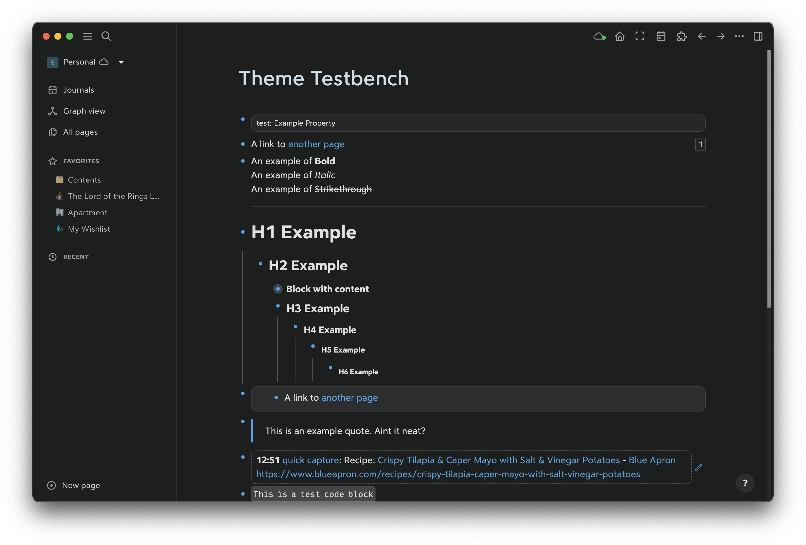
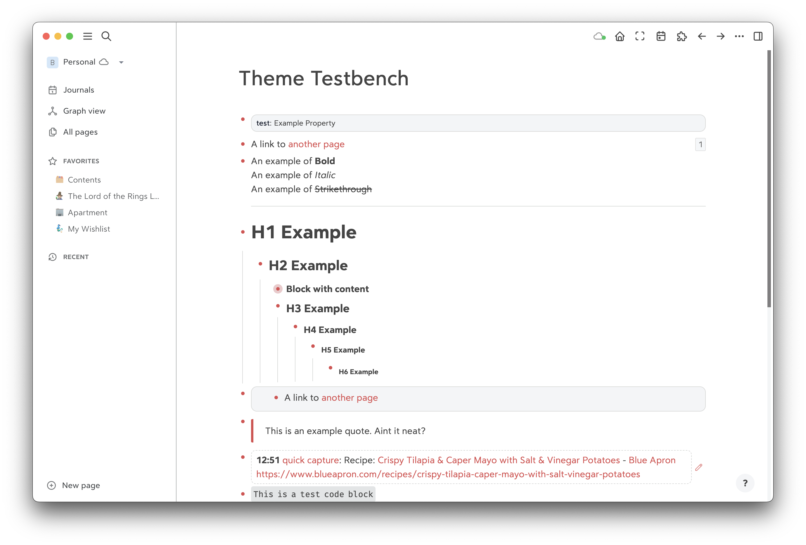

# Logseeq Bear 2 Theme

An attempt to replicate the look/feel of Bear 2 in Logseq.

## Dark Mode


## Light Mode


## Notes

The theme defaults to the Bear UI font if installed. Otherwise it uses Avenir.

## Installation

Add this line to your `custom.css` file.

```css
@import url('https://www.brandonbutler.me/logseq-bear-2-theme/bear2.css');
```